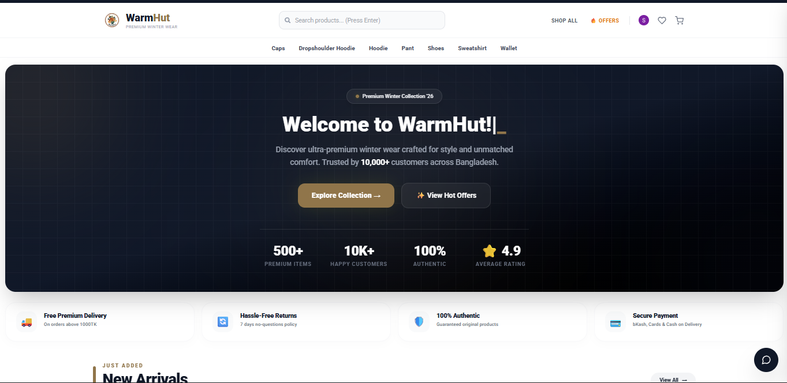
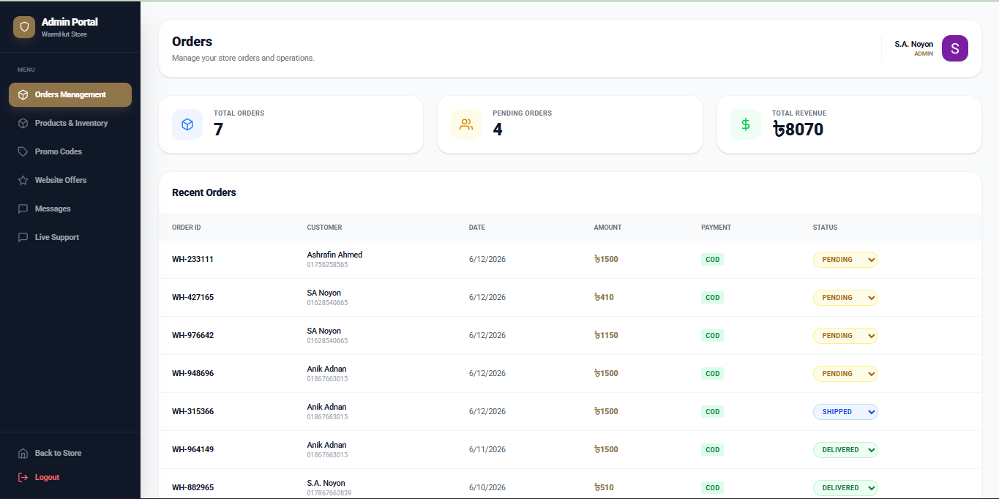
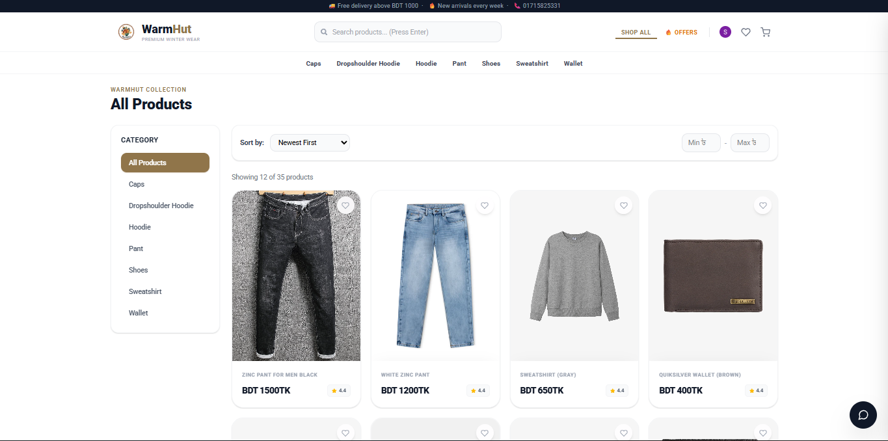

  

  # WarmHut - Premium Winter Wear
  
  **A Modern, Full-Stack E-Commerce Platform for Premium Winter Clothing**

  
  
  
  
  
  

---

## 📖 Short Description

WarmHut is a high-performance, responsive e-commerce application tailored specifically for the premium winter wear market in Bangladesh. It boasts a sleek, premium UI inspired by modern design trends, offering a seamless shopping experience for customers and a robust management system for administrators. It comes with full backend integration for orders, live chat support, product inventory, and dynamic promo offers.

---

## ✨ Key Features

### 🛍️ Customer Experience
- **Premium UI/UX:** A stunning, mobile-first design with smooth animations (AOS), glassmorphism effects, and a highly responsive grid system.
- **Dynamic Product Discovery:** Sticky dynamic category navigation, intelligent search, and real-time filtering.
- **Authentication:** Secure Email & Password login, plus **Google OAuth** integration powered by Better Auth.
- **User Dashboard:** Dedicated portal for users to manage profiles, track order history, and download PDF invoices.
- **Shopping Cart & Wishlist:** Persistent state management for a frictionless checkout journey.
- **Live Support Chat:** Real-time customer support chat directly on the website.

### 🛡️ Admin Capabilities
- **Secure Admin Panel:** Role-based access control protecting the dashboard.
- **Inventory Management:** Full CRUD operations for products and dynamic categories.
- **Order & Promo Tracking:** Real-time visibility into customer orders, dynamic website offers, and promo code management.
- **Live Customer Support:** Dedicated live chat dashboard to interact with customers in real-time.
- **Media Management:** Automatic image uploads and optimizations using Cloudinary.
- **Email Notifications:** Automated email delivery for order confirmations and contact messages.

---

## ⚙️ How it works

1. **User Authentication:** Users can securely log in using email/password or their Google account. Their session is managed seamlessly by Better Auth.
2. **Shopping Flow:** Users browse products, add them to the cart, apply promo codes, and proceed to checkout securely.
3. **Order Processing:** Upon checkout, the backend processes the order, saves it to MongoDB, and automatically sends a beautifully formatted email invoice via Nodemailer.
4. **Live Chat System:** Socket.io establishes a persistent connection, allowing users to send real-time queries to the admin. The admin can read and reply to messages instantly from the dashboard.
5. **Admin Dashboard Control:** The admin can oversee all orders, manage the product catalog (with images handled by Cloudinary), reply to live chats, and dynamically update the "Website Offers" displayed on the front page.

---

## 🛠️ Tech Stack (Built With)

### Frontend (Client)
- **Framework:** React.js v19 (Vite)
- **Styling:** Tailwind CSS v4 + Vanilla CSS
- **Routing:** React Router v7
- **Icons & UI:** React Icons, AOS (Animate On Scroll), Typed.js
- **Real-time:** Socket.io-client
- **Utilities:** jsPDF (Invoice Generation)

### Backend (Server)
- **Runtime:** Node.js
- **Framework:** Express.js v5
- **Database:** MongoDB with Mongoose ODM
- **Authentication:** Better-Auth
- **Storage:** Cloudinary (via Multer)
- **Email Delivery:** Nodemailer
- **Real-time:** Socket.io

---

## 🚀 Usage & Screenshots

### Screenshots

  
  
<em>Home Page Overview</em>

  
  
  
<em>Admin Dashboard - Live Chat & Orders</em>

  
  
  
<em>Product Catalog & Filtering</em>

### Getting Started

**1. Clone the repository**
\`\`\`bash
git clone https://github.com/your-username/warmhut.git
cd warmhut
\`\`\`

**2. Install Dependencies**
You will need to install dependencies for both the frontend and backend.
\`\`\`bash
# Install frontend dependencies
npm install

# Install backend dependencies
cd server
npm install
\`\`\`

**3. Environment Variables**
Create a \`.env\` file in the \`server\` directory with the necessary keys (MongoDB, Cloudinary, SMTP for emails, and Better Auth secrets).

**4. Run the Application**
\`\`\`bash
# Run both frontend and backend concurrently
npm run dev:all
\`\`\`

  
Built with ❤️ for WarmHut. Elevating the Winter Fashion standard.

